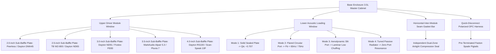
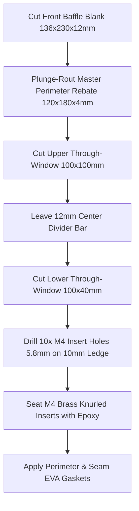
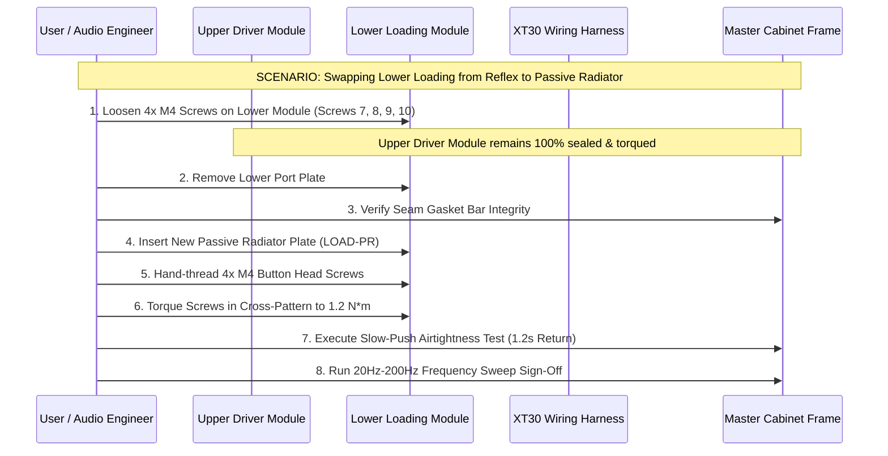

# 03. Enclosure Bill of Materials (BOM), Hardware & Split Modular Assembly Guide

---

## 1. Executive Summary & Split Modular System Architecture

This guide provides the comprehensive engineering, materials, acoustic damping, and assembly specifications for a high-performance **3.5-Liter Desktop Reference Loudspeaker Enclosure** featuring a **Split Modular Sub-Baffle & Multi-Topology Acoustic Loading System**.

The split-baffle architecture decouples the transducer from the acoustic loading mechanism. The front baffle is divided into two independently swappable functional zones:
1. **Upper Driver Module ($120\text{ mm} \times 116\text{ mm}$)**: Houses interchangeable **2.0", 2.5", 3.0", 3.5", and 4.0" drivers** with dedicated M3/M4 threaded inserts, flush rebates, and $45^\circ$ aerodynamic breathing chamfers.
2. **Lower Acoustic Loading Module ($120\text{ mm} \times 56\text{ mm}$)**: Houses swappable low-frequency loading topologies:
   - **Mode 1: Sealed Acoustic Suspension** (Solid Aluminum/Birch plate, $Q_{tc} \approx 0.707$)
   - **Mode 2: Front-Firing Flared Bass-Reflex** (Precision circular flared port tube, $F_b = 62\text{ Hz} - 75\text{ Hz}$)
   - **Mode 3: Aerodynamic Slit / Slot Port** (Laminar slot vent with flared lips, $F_b = 60\text{ Hz} - 70\text{ Hz}$)
   - **Mode 4: Passive Radiator (Drone Cone)** (Matching tuned passive radiator, $F_b = 55\text{ Hz} - 65\text{ Hz}$)

```
+-----------------------------------------------------------------------------------------------+
|                       SPLIT MODULAR INTERCHANGEABLE ACOUSTIC PLATFORM                         |
|                                                                                               |
|   Internal Net Volume (Vb)       : 3.34 - 3.50 Liters (accounting for brace & displacement)   |
|   Master Baffle Opening          : Dual Rebated Window with 12mm Structural Divider Bar       |
|   Upper Driver Module Window     : 120 mm (W) x 116 mm (H) x 12mm / 15mm Depth               |
|   Lower Loading Module Window    : 120 mm (W) x 56 mm (H) x 12mm / 15mm Depth                |
|   Inter-Module Gasket Bar        : 10 mm wide x 1.5 mm thick Closed-Cell EVA Seam Bar         |
|   Fastener System                : 10x M4 Knurled Brass Inserts + Button Head Machine Screws  |
|   Electrical Interface           : Polarized Quick-Disconnect OFC Harness (Zero Soldering)    |
|   Swapping Autonomy              : Swap Driver without breaking Port Seal (and vice-versa)    |
+-----------------------------------------------------------------------------------------------+
```



---

## 2. Comprehensive Bill of Materials (BOM) & Sourcing Matrix

The bill of materials below specifies all mechanical, electrical, acoustic, and hardware components needed to build a complete stereo pair with the full split modular sub-baffle and multi-loading family.

### 2.1 Enclosure Structure & Master Frame Materials

| Item # | Component | Description / Specification | Quantity | Est. Cost (USD) | Est. Cost (JPY) | Sourcing / Part Reference |
| :--- | :--- | :--- | :---: | :--- | :--- | :--- |
| **M-01** | **Baltic Birch Plywood** | 12 mm or 15 mm Grade BB/BB Russian/Finnish Birch (9-ply) | 1 sheet (600x900mm) | $28.00 - $42.00 | ¥4,200 - ¥6,500 | Timber merchant, Kurashiki, Home Depot |
| **M-02** | **High-Density MDF** | Alternative: 12mm / 15mm Formaldehyde-free High-Density MDF | 1 sheet (600x900mm) | $18.00 - $25.00 | ¥2,700 - ¥3,800 | Local lumber yard, MonotaRO |
| **M-03** | **Internal Window Brace** | 12 mm Baltic Birch, CNC / scroll saw cut ($112 \times 166\text{ mm}$) | 2 pcs (1/box) | (From M-01 stock) | — | Built from sheet M-01 |
| **M-04** | **Cabinet Isolation Feet** | 20mm x 8mm Sorbothane / Silicone isolation hemispheres | 8 pcs | $6.00 | ¥900 | Hudson Hi-Fi, Soundcare, Amazon |

### 2.2 Split Modular Sub-Baffle & Fastening Hardware

| Item # | Component | Description / Specification | Quantity | Est. Cost (USD) | Est. Cost (JPY) | Sourcing / Part Reference |
| :--- | :--- | :--- | :---: | :--- | :--- | :--- |
| **SB-01** | **Upper Driver Module Blanks** | 12 mm Baltic Birch / 6061 Aluminum / PETG-CF ($120 \times 116\text{ mm}$) | 10 pcs (5 pairs) | $22.00 - $35.00 | ¥3,300 - ¥5,200 | Laser-cut Birch / CNC / 3D Print |
| **SB-02** | **Lower Loading Module Blanks** | 12 mm Baltic Birch / 6061 Aluminum / PETG-CF ($120 \times 56\text{ mm}$) | 8 pcs (4 pairs) | $16.00 - $26.00 | ¥2,400 - ¥3,900 | Laser-cut Birch / CNC / 3D Print |
| **SB-03** | **Master Frame Threaded Inserts** | M4 internal thread x 8.1mm knurled brass inserts (Ruthex / T-Nuts) | 20 pcs (10/box) | $6.00 | ¥900 | Ruthex RX-M4x8.1, McMaster 94180A351 |
| **SB-04** | **Driver / PR Mounting Inserts** | M3 & M4 knurled brass inserts for sub-baffle driver & PR mounting | 36 pcs | $8.00 | ¥1,200 | McMaster-Carr, Amazon, AliExpress |
| **SB-05** | **Module Perimeter Screws** | M4 x 16mm ISO 7380 Black Oxide / Stainless Socket Button Head | 20 pcs | $5.00 | ¥750 | McMaster 92095A214, MonotaRO |
| **SB-06** | **Driver & PR Mounting Screws**| M3 x 12mm & M4 x 14mm Black Hex Socket Machine Screws | 36 pcs | $6.00 | ¥900 | McMaster, MonotaRO |
| **SB-07** | **Master Frame Perimeter Gasket**| 1.5mm thick, 10mm wide closed-cell high-density EVA / Neoprene tape | 4 meters | $6.00 | ¥900 | Nitto Denko, Parts Express 260-540 |
| **SB-08** | **Inter-Module Seam Gasket Bar**| 1.5mm thick, 10mm wide closed-cell EVA die-cut center divider bar | 4 pcs | $3.00 | ¥450 | Laser-cut from 1.5mm EVA Sheet |
| **SB-09** | **Passive Radiator Units (Opt)**| 3" - 4" Tuned Passive Radiator (Dayton ND90-PR or SD115-PR) | 1 pair (2 pcs) | $24.00 - $34.00 | ¥3,600 - ¥5,100 | Dayton Audio ND90-PR / Parts Express |

### 2.3 Quick-Disconnect Electrical Wiring Harness (Zero Soldering)

| Item # | Component | Description / Specification | Quantity | Est. Cost (USD) | Est. Cost (JPY) | Sourcing / Part Reference |
| :--- | :--- | :--- | :---: | :--- | :--- | :--- |
| **E-01** | **5-Way Binding Posts** | Gold-plated, insulated chassis mount, banana / spade compatible | 2 pairs (4 posts) | $12.00 - $22.00 | ¥1,800 - ¥3,300 | Dayton Audio BPA-38G / CMC-838 |
| **E-02** | **Internal OFC Wiring** | 16 AWG (1.3 mm²) High-Purity Oxygen-Free Copper flexible wire | 3 meters | $6.00 | ¥900 | Mogami 3103, Canare 4S6, Parts Express |
| **E-03** | **Polarized Inline Disconnects** | Amass XT30U Gold 2-pole polarized connectors (or WAGO 221-412) | 4 sets | $5.00 | ¥750 | Amass XT30, WAGO 221-412 |
| **E-04** | **Driver Quick Spade Disconnects** | 0.205" (5.2mm), 0.187" (4.8mm), 0.110" (2.8mm) gold-plated Faston | 20 pcs | $6.00 | ¥900 | TE Connectivity, Parts Express 095-282 |
| **E-05** | **Heat Shrink Tubing** | 3.5mm & 6.0mm 3:1 dual-wall polyolefin with hot-melt sealant | 1 meter | $3.00 | ¥450 | 3M, Sumitomo Sumitube |
| **E-06** | **Anti-Rattle Wire Foam** | 10mm ID open-cell acoustic foam sleeve for internal wire runs | 1 meter | $3.00 | ¥450 | McMaster 9350K11, Amazon wire sleeve |

### 2.4 Acoustic Damping Materials

| Item # | Component | Description / Specification | Quantity | Est. Cost (USD) | Est. Cost (JPY) | Sourcing / Part Reference |
| :--- | :--- | :--- | :---: | :--- | :--- | :--- |
| **A-01** | **Needle Felt Wall Liner** | 8 mm - 10 mm high-density acoustic needle punch felt sheet | 0.6 m² | $12.00 | ¥1,800 | MonotaRO Felt, Soundproof Cow |
| **A-02** | **Carded Pure Sheep Wool** | 100% natural carded wool or Dacron polyfill (low density core) | 120 grams | $8.00 | ¥1,200 | Twaron Angel Hair, Monacor MDM-3 |
| **A-03** | **Acoustic Sealant** | Non-hardening butyl rubber / permanently flexible silicone | 1 tube | $5.00 | ¥750 | DAP Dynaflex 230 / Cemedine POS Seal |

### 2.5 Total Platform Investment Summary

```
+------------------------------------------------------------------------------------+
|                         TOTAL PLATFORM COST BREAKDOWN (PAIR)                       |
+------------------------------------+-----------------------+-----------------------+
| Configuration Tier                 | Est. Cost (USD)       | Est. Cost (JPY)       |
+------------------------------------+-----------------------+-----------------------+
| Base Enclosure + 1 Driver + 1 Port | $88.00 - $118.00      | ¥13,000 - ¥17,500     |
| Complete Split Modular Studio Lab  |                       |                       |
| (5 Driver Pairs + 4 Loading Modes +| $165.00 - $225.00     | ¥24,500 - ¥33,500     |
| Passive Radiators + Quick Harness) |                       |                       |
+------------------------------------+-----------------------+-----------------------+
```

---

## 3. Split Frame Architecture & Inter-Module Seam Gasketing

The front baffle consists of a permanent master framework with two precision rebate pockets separated by a structural **$12.0\text{ mm}$ cross-divider bar**.

```
       MASTER BAFFLE REBATE & FASTENER GEOMETRY (FRONT VIEW)

       +-------------------------------------------------------------+
       |                  CABINET TOP (136 mm Width)                 |
       |  (1) [M4 Insert]                       (2) [M4 Insert]      |
       |       +---------------------------------------------+       |
       |       |  UPPER DRIVER MODULE (120 mm x 116 mm)      |       |
       |  (6)  |                                             |  (3)  |
       | [M4]  |        [ Driver Cutout & 45° Chamfer ]      | [M4]  |
       |       |        (Fits 2.0", 2.5", 3.0", 3.5", 4.0")  |       |
       |       |                                             |       |
       |  (5)  +---------------------------------------------+  (4)  |
       | [M4]  |=============================================| [M4]  |
       |       |  INTER-MODULE SEAM GASKET BAR (10mm wide)   |       |
       |  (7)  +---------------------------------------------+  (10) |
       | [M4]  |  LOWER LOADING MODULE (120 mm x 56 mm)      | [M4]  |
       |       |  [ Sealed / Flared Port / Slit / PR ]       |       |
       |       +---------------------------------------------+       |
       |  (8) [M4 Insert]                       (9) [M4 Insert]      |
       |                 CABINET BOTTOM (230 mm Height)              |
       +-------------------------------------------------------------+
```

### 3.1 Split Frame Gasket Sealing Technique

To achieve **zero inter-chamber cross-leakage and zero atmospheric leakage** under high acoustic sound pressure ($> 105\text{ dB SPL}$):

```
       INTER-MODULE SEAM GASKET DETAIL (SAGITTAL CUTAWAY)

       Front Outer Face
       +--------------------+      +--------------------+
       | UPPER DRIVER PLATE |      | LOWER PORT PLATE   |
       | (12.0mm Birch/Alum)|      | (12.0mm Birch/Alum)|
       +---------+----------+      +----------+---------+
                 |                            |
                 v                            v
       +------------------------------------------------+
       | 1.5mm CLOSED-CELL EVA COMPRESSION GASKET SHEET |  <-- Continuous Hermetic Seal
       +------------------------------------------------+
                 |                            |
                 v                            v
       +--------------------+======+--------------------+
       | UPPER LANDING RIM  | SEAM | LOWER LANDING RIM  |
       | (10mm Wide Ledge)  | BAR  | (10mm Wide Ledge)  |
       +--------------------+======+--------------------+
         Cabinet Master Frame (12mm Structural Divider)
```

1. **Continuous Master Perimeter Gasket**:
   - Apply a continuous strip of $1.5\text{ mm} \times 10\text{ mm}$ closed-cell high-density EVA foam tape around the upper outer rim and lower outer rim.
2. **Inter-Module Seam Gasket Bar (T-Junction Sealing)**:
   - Apply a full-width $1.5\text{ mm} \times 10\text{ mm} \times 120\text{ mm}$ EVA gasket strip directly onto the $12.0\text{ mm}$ central divider bar.
   - The ends of the seam bar butt tightly against the side perimeter gaskets with zero gap. Apply a microscopic dab of flexible cyanoacrylate or silicone at the T-junction corners.
3. **Independent Module Clamping**:
   - The Upper Driver Module is secured by **6x M4 screws** (screws 1, 2, 3, 4, 5, 6).
   - The Lower Loading Module is secured by **4x M4 screws** (screws 7, 8, 9, 10).
   - *Autonomous Swapping Advantage*: The builder can unscrew and swap the Lower Loading Module (e.g. going from Bass-Reflex to Passive Radiator) while the Upper Driver Module remains under full torque, **preserving 100% of the upper driver gasket's airtight seal**.

---

## 4. Sub-Baffle Family Specifications (Upper & Lower Modules)

### 4.1 Upper Driver Module Specifications ($120\text{ mm} \times 116\text{ mm}$)

All upper driver plates share the identical outer rectangle of $120.0\text{ mm} \times 116.0\text{ mm} \times 12.0\text{ mm}$ with 6x perimeter $\varnothing 4.5\text{ mm}$ clearance holes (countersunk for M4 button head screws).

| Plate ID | Driver Class | Example Transducers | Through Cutout ($D_{cut}$) | Flush Rebate ($D_{reb}$) | Rebate Depth ($T_{reb}$) | Screw PCD | Fasteners |
| :--- | :--- | :--- | :---: | :---: | :---: | :---: | :---: |
| **DRV-20** | **2.0-Inch** Micro Full-Range | Peerless PLS-P830983, Dayton DMA45 | **$48.0\text{ mm}$** | $58.0\text{ mm}$ | $3.0\text{ mm}$ | $\varnothing 53.5\text{ mm}$ | 4x M3 Inserts |
| **DRV-25** | **2.5-Inch** Wideband | Tang Band W2-800SL, Dayton ND65-4 | **$54.0\text{ mm}$** | $65.0\text{ mm}$ | $3.5\text{ mm}$ | $\varnothing 60.0\text{ mm}$ | 4x M3 Inserts |
| **DRV-30** | **3.0-Inch** Reference (Std) | Dayton ND91-4, TB W3-881, Fostex FE83 | **$76.0\text{ mm}$** | $96.0\text{ mm}$ | $4.0\text{ mm}$ | $\varnothing 86.0\text{ mm}$ | 4x M4 Inserts |
| **DRV-35** | **3.5-Inch** Audiophile | MarkAudio Alpair 5.3, Pluvia 7.2 | **$84.0\text{ mm}$** | $102.0\text{ mm}$ | $4.5\text{ mm}$ | $\varnothing 93.0\text{ mm}$ | 4x M4 Inserts |
| **DRV-40** | **4.0-Inch** High Output | Dayton RS100-4, Scan-Speak 10F | **$94.0\text{ mm}$** | $114.0\text{ mm}$ | $4.5\text{ mm}$ | $\varnothing 104.0\text{ mm}$ | 4x M4 Inserts |

> [!IMPORTANT]
> **Rear Airflow Relief**: Every upper driver plate must feature a **$45^\circ$ expanding breathing chamfer** on the rear face opening, expanding the rear aperture by $+12\text{ mm}$ to $+16\text{ mm}$ beyond the through-cutout to eliminate acoustic tunnel compression behind the driver cone.

---

### 4.2 Lower Acoustic Loading Module Specifications ($120\text{ mm} \times 56\text{ mm}$)

All lower loading plates share the standardized outer dimensions of $120.0\text{ mm} \times 56.0\text{ mm} \times 12.0\text{ mm}$ with 4x perimeter $\varnothing 4.5\text{ mm}$ clearance holes at the corners.

```
       THE 4 INTERCHANGEABLE ACOUSTIC LOADING TOPOLOGIES

   1. MODE 1: SEALED BLANK           2. MODE 2: FLARED BASS-REFLEX
   +---------------------------+     +---------------------------+
   |                           |     |          ( O )            |
   |   [ Solid 12mm Birch ]    |     |   Flared Circular Port    |
   |   [ Sealed Qtc ~0.707 ]   |     |   (Ø32mm / Ø35mm Tube)    |
   +---------------------------+     +---------------------------+

   3. MODE 3: SLIT / SLOT PORT       4. MODE 4: PASSIVE RADIATOR
   +---------------------------+     +---------------------------+
   | +-----------------------+ |     |      +-------------+      |
   | | Aerodynamic Slot Port | |     |      |  ND90-PR    |      |
   | +-----------------------+ |     |      +-------------+      |
   +---------------------------+     +---------------------------+
```

#### Detailed Loading Topology Specifications:

1. **Mode 1: Sealed Acoustic Suspension Plate (`LOAD-SEAL`)**:
   - **Structure**: Solid $12\text{ mm}$ Baltic Birch, 6061 Aluminum, or dense 3D printed PETG-CF blank plate.
   - **Acoustic Characteristics**: Completely hermetic enclosure; clean second-order $12\text{ dB/octave}$ roll-off; maximum transient speed and group delay $< 2\text{ ms}$; optimal for Fostex FE83NV2 or high-$Q_{ts}$ 2" full-range drivers.
   - **Internal Damping**: Increase loose wool filling to **$65\text{ g}$** to achieve maximum isothermal air compliance.

2. **Mode 2: Front-Firing Flared Bass-Reflex Port Plate (`LOAD-PORT`)**:
   - **Structure**: Precision cutout with internal $3\text{D}$ printed dual-flared port tube ($\varnothing 32.0\text{ mm}\text{ ID} \times 138.0\text{ mm}\text{ Length}$ for $F_b = 62.0\text{ Hz}$, or $\varnothing 35.0\text{ mm}\text{ ID} \times 105.0\text{ mm}\text{ Length}$ for $F_b = 75.0\text{ Hz}$).
   - **Acoustic Characteristics**: Classic 4th-order reflex alignment; extends bass response down to $56\text{ Hz}$ ($F_3$) with high efficiency; front-firing location eliminates wall-boundary interference when placed close to back walls.

3. **Mode 3: Aerodynamic Slit / Slot Port Plate (`LOAD-SLIT`)**:
   - **Structure**: Horizontal slot vent ($90.0\text{ mm}\text{ Width} \times 12.0\text{ mm}\text{ Height} \times 125.0\text{ mm}\text{ Duct Length}$) with $R = 6.0\text{ mm}$ fully radiused mouth lips.
   - **Acoustic Characteristics**: Distributed laminar boundary airflow; highly resistant to high-volume organ-pipe whistling; sleek studio-monitor aesthetic.

4. **Mode 4: Tuned Passive Radiator Plate (`LOAD-PR`)**:
   - **Structure**: Cutout ($\varnothing 76.0\text{ mm}$ through, $\varnothing 96.0\text{ mm} \times 4.0\text{ mm}$ rebate, 4x M4 inserts on $\varnothing 86.0\text{ mm}$ PCD) mounting a **Dayton Audio ND90-PR** or **SD115-PR** passive radiator.
   - **Acoustic Characteristics**: Provides the low bass extension of a vented box with **zero port turbulence, zero air chuffing, and zero midrange leakage** through the port tube.
   - **Mass Tuning**: Add 5g to 15g brass washer weights to the PR center post to fine-tune $F_b$ between **$52\text{ Hz}$ and $65\text{ Hz}$**.

---

## 5. Quick-Disconnect Wiring Harness & Zero-Solder Platform

```
+-----------------------------------------------------------------------------------------------+
|                       ZERO-SOLDER QUICK-DISCONNECT HARNESS TOPOLOGY                           |
|                                                                                               |
|   +---------------------------------------------------------------------------------------+   |
|   | REAR PANEL BINDING POSTS (Gold-Plated 5-Way Chassis Terminals)                        |   |
|   +---------------------------------------------------------------------------------------+   |
|                                |                                                              |
|                                | 16 AWG High-Purity OFC Wire (180 mm) in Acoustic Foam Sleeve |
|                                v                                                              |
|   +---------------------------------------------------------------------------------------+   |
|   | POLARIZED INLINE CONNECTOR (Amass XT30U Gold 30A Polarized Quick-Release)              |   |
|   | Pin 1 (+): Red Lead  |  Pin 2 (-): Black Lead                                         |   |
|   +---------------------------------------------------------------------------------------+   |
|                                |                                                              |
|                                | Driver Pigtail Harness (100 mm Ultra-Flex Silicone OFC)      |
|                                v                                                              |
|   +---------------------------------------------------------------------------------------+   |
|   | PRE-TERMINATED DRIVER FASTON DISCONNECTS                                              |   |
|   | (+) Red 0.205" (5.2mm) Gold Spade  ====> Driver Positive Terminal Tag                 |   |
|   | (-) Black 0.110" (2.8mm) Gold Spade ====> Driver Negative Terminal Tag                |   |
|   +---------------------------------------------------------------------------------------+   |
+-----------------------------------------------------------------------------------------------+
```

---

## 6. Fabrication, Machining & 3D Printing Guide

### 6.1 Woodworking & Machining of Master Split Frame



1. **Outer Dimensions & Rebating**:
   - Cut front baffle blank to $136.0\text{ mm} \times 230.0\text{ mm} \times 12.0\text{ mm}$.
   - Using a plunge router with a straight mortising bit and edge guide, rout a continuous **$4.0\text{ mm}$ deep rebate** to establish the $120.0\text{ mm} \times 180.0\text{ mm}$ outer socket.
2. **Window Apertures & Divider Bar**:
   - Rout the upper through-window to $100.0\text{ mm} (\text{W}) \times 100.0\text{ mm} (\text{H})$.
   - Leave a solid **$12.0\text{ mm}$ wide structural divider bar** across the horizontal centerline.
   - Rout the lower through-window to $100.0\text{ mm} (\text{W}) \times 40.0\text{ mm} (\text{H})$.
   - This leaves a uniform **$10.0\text{ mm}$ wide landing ledge** around all perimeters for gasket seating and M4 insert placement.
3. **M4 Brass Insert Installation**:
   - Drill 10 pilot holes of **$\varnothing 5.8\text{ mm}$** into the landing ledge ($11.0\text{ mm}$ deep):
     * 6 holes around the upper window (4 corners + 2 sides).
     * 4 holes around the lower window (4 corners).
   - Coat insert threads with 5-minute epoxy and seat them $0.2\text{ mm}$ sub-flush using a hex driver.

---

### 6.2 3D Printing Guide for Sub-Baffle Modules

For rapid digital fabrication, sub-baffle plates and port adapters can be 3D printed:

```
       +------------------------------------------------------------+
       |         FDM SLICER PROFILE FOR SPLIT SUB-BAFFLE PLATES     |
       |                                                            |
       |   Filament Material    : Carbon-Fiber PETG (PETG-CF) / ABS |
       |   Nozzle Diameter      : 0.4 mm or 0.6 mm                  |
       |   Wall Perimeters      : 8 to 10 walls (>= 3.6 mm solid)   |
       |   Top / Bottom Layers  : 8 solid layers (>= 2.4 mm solid)  |
       |   Infill Pattern       : GYROID (Acoustic Resonance Trap)  |
       |   Infill Density       : 50% - 60%                         |
       |   Threaded Inserts     : Heat-Set Brass M3/M4 (235°C Iron) |
       +------------------------------------------------------------+
```

---

## 7. Step-by-Step Assembly & Independent Hot-Swap Procedure



### 7.1 Independent Swapping Protocols

#### Protocol A: Swapping the Upper Driver Module (Under 2 Minutes)
1. **Disassembly**:
   - Loosen the 6 M4 screws securing the Upper Driver Module (Screws 1, 2, 3, 4, 5, 6).
   - Tilt the driver plate forward and unclip the **XT30 polarized connector**.
   - *Note*: The Lower Loading Module remains fully torqued and sealed.
2. **Installation**:
   - Plug the new driver plate's pigtail into the XT30 harness.
   - Tuck wire neatly behind the internal window brace.
   - Seat the plate against the $1.5\text{ mm}$ EVA gasket and hand-start the 6 M4 screws.
   - Tighten following the **Upper 6-Point Cross Pattern** ($1.2 - 1.5\text{ N}\cdot\text{m}$):
     `[1] Top-Left -> [4] Bottom-Right -> [2] Top-Right -> [5] Bottom-Left -> [3] Mid-Right -> [6] Mid-Left`

#### Protocol B: Swapping the Lower Loading Module (Under 1 Minute)
1. **Disassembly**:
   - Loosen the 4 M4 screws securing the Lower Loading Module (Screws 7, 8, 9, 10).
   - Remove plate. (Zero electrical disconnect required).
2. **Installation**:
   - Seat new loading plate (e.g. `LOAD-SEAL`, `LOAD-PORT`, `LOAD-SLIT`, or `LOAD-PR`).
   - Hand-start all 4 M4 screws.
   - Tighten following the **Lower 4-Point Cross Pattern** ($1.2 - 1.5\text{ N}\cdot\text{m}$):
     `[7] Top-Left -> [9] Bottom-Right -> [10] Top-Right -> [8] Bottom-Left`

---

## 8. Quality Control, Airtightness & Acoustic Verification Checklist

Prior to acoustic testing or critical listening after any driver or port module swap:

```
                  POST-SWAP 4-STEP VERIFICATION MATRIX

    +-------------------+      +-------------------+      +-------------------+
    | 1. POLARITY CHECK |      | 2. SLOW-PUSH TEST |      | 3. SINE SWEEP QC  |
    | DC 1.5V Battery   | ===> | Depress cone 3mm  | ===> | 20 Hz - 200 Hz    |
    | Forward Excursion |      | Rebound >= 1.0s   |      | Zero Buzz/Chuff   |
    +-------------------+      +-------------------+      +-------------------+
```

### 8.1 Verification Pass / Fail Standards

| Test | Procedure | Target Pass Standard | Corrective Action if Failed |
| :--- | :--- | :--- | :--- |
| **Polarity Pop Test** | Momentarily connect 1.5V DC to binding posts | Driver cone displaces smoothly **FORWARD** | Reverse Faston spades at driver terminal |
| **Pneumatic Slow-Push**| Gently depress cone 3mm and release | Cone recovers smoothly over **$1.0\text{ s} - 1.5\text{ s}$** | Re-torque seam screws; check EVA gasket seam |
| **Acoustic Sweep** | 20 Hz – 200 Hz sine sweep at 1W RMS | Clean tone reproduction, zero rattles | Secure loose internal wire; clear port intake |
| **Seam Leak Detection**| Run 40 Hz tone at 3W; inspect seam bar with hand | **Zero air puffing** felt at inter-module seam | Tighten seam screws (4, 5, 7, 10) by 1/4 turn |

---

## 9. Master Sign-Off Checklist

- [ ] **Master Frame**: 10x M4 brass inserts installed flush and verified perpendicular.
- [ ] **Inter-Module Seam Gasket**: Full-width $1.5\text{ mm}$ EVA seam bar seated with zero corner gaps.
- [ ] **Driver Module**: Rear $45^\circ$ airflow chamfer verified on chosen driver plate.
- [ ] **Wiring Harness**: 16 AWG OFC wire sheathed in foam; XT30 connector securely keyed.
- [ ] **Loading Module**: Selected loading plate (`LOAD-SEAL`, `LOAD-PORT`, `LOAD-SLIT`, or `LOAD-PR`) seated and sealed.
- [ ] **Anti-Strip Torquing**: All M4 button head screws torqued in cross-pattern to $1.2 - 1.5\text{ N}\cdot\text{m}$.
- [ ] **Pneumatic Hermetic Seal**: Passed slow cone recovery test ($\ge 1.0\text{ s}$).
- [ ] **Polarity**: Confirmed positive outward cone excursion under DC positive voltage.
- [ ] **Acoustic Sign-Off**: 20 Hz – 500 Hz sweep completed with zero chuffing or mechanical resonance.
